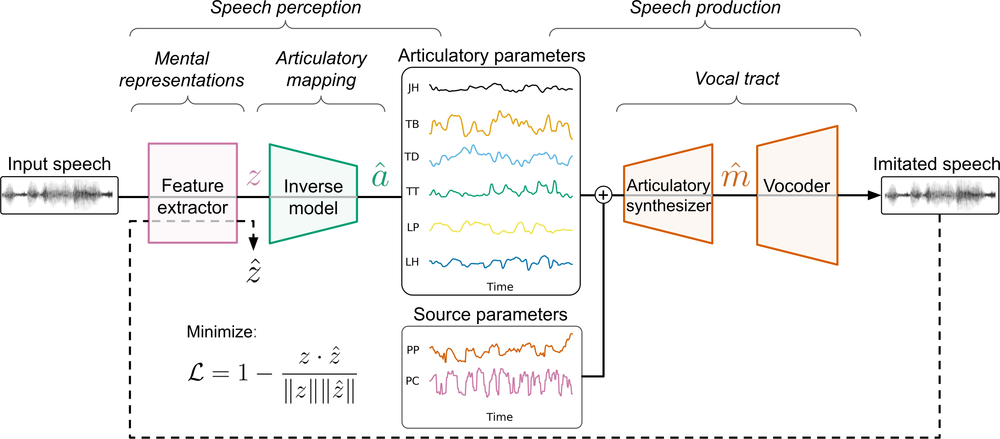

# From perception to production: how acoustic invariance facilitates articulatory learning in a self-supervised vocal imitation model

**Paper**: [arXiv:2509.05849](https://arxiv.org/abs/2509.05849)

```text
@inproceedings{lavechin2025perception,
  title={From perception to production: how acoustic invariance facilitates articulatory learning in a self-supervised vocal imitation model},
  author={Lavechin, Marvin and Hueber, Thomas},
  booktitle={Proceedings of the 2025 Conference on Empirical Methods in Natural Language Processing},
  pages={23863--23874},
  year={2025}
}
```

## Overview

This repository implements a framework for modeling the acoustic-to-articulatory mapping problem through self-supervised learning.
The framework consists of:

1) **Feature extractors**: MFCC or Wav2Vec 2.0 pre-trained representations to represent speech
2) **Inverse Model**: LSTM-based model mapping acoustic features to articulatory parameters
3) **Synthesizer**: Feed-forward network converting articulatory parameters to mel-spectrograms
4) **Vocoder**: HiFi-GAN to map mel-spectrograms to raw audio



## Installation

```sh
conda create --name agent python=3.8 && conda activate agent

# 1. Install this repo
git clone https://github.com/MarvinLvn/agent
cd agent
conda env create -f env.yml

# 2. Install hifi-gan dependency
git clone https://github.com/MarvinLvn/hifi-gan
cd hifi-gan
pip install -e .
```


## Datasets

The code supports datasets with:
- Audio files: WAV format, 16kHz
- Articulatory data: electromagnetic articulography (EMA), optional
- Phonetic labels: LAB format, optional

Pre-cofnigure datasets include:
- PB2007 and PB2009: French EMA dataset
- Audiocite: French read speech without articulatory data

### Setup datasets

1. Configure datasets in datasets_infos.yaml:

```yaml
your_dataset:
  # Path to wav files
  wav_pathname: ./external/raw_datasets/your_dataset/*.wav
  # Path to EMA files (optional)
  ema_pathname: ./external/raw_datasets/your_dataset/*.ema
  # EMA files format (`seq` or `est`)
  ema_format: est
  # EMA sampling rate (in hertz)
  ema_sampling_rate: 100
  # Factor by which the EMA coordinates must be divided to be in millimeters
  ema_scaling_factor: 0.1
  # Column indices corresponding to the coordinates:
  # [lower_incisor_x, lower_incisor_y, tongue_tip_x, tongue_tip_y, tongue_middle_x, tongue_middle_y, tongue_back_x, tongue_back_y, lower_lip_x, lower_lip_y, upper_lip_x, upper_lip_y, velum_x, velum_y]
  # (velum coordinates are optional)
  ema_coils_order: [0, 6, 1, 7, 2, 8, 3, 9, 5, 11, 4, 10]
  # Set to true to apply a lowpass filter to EMA coordinates before importation
  ema_needs_lowpass: false
   # Path to the `.lab` files (`glob` format, optional) 
  lab_pathname: ./external/raw_datasets/your_dataset/*.lab
  # Factor by which the `.lab` timings must be divided to be in seconds
  lab_resolution: 10000000
```

2. Preprocess datasets:

```sh
python preprocess_datasets.py
```

After preprocessing, each dataset will have the following structure:
```shell
datasets/your_dataset/
├── wav/              # Resampled 16kHz audio files
├── mel/              # Mel-spectrograms (.npy)
├── source/           # 2-dim source parameters (.npy)
├── ema/              # Processed EMA coordinates (.bin, optional)
├── art_params/       # 6-7 dim articulatory parameters (.npy, optional)
├── lab/              # Frame-aligned phonetic labels (.lab, optional)
├── art_model.pickle  # Articulatory transformation model (optional)
└── ema_limits.pickle # EMA coordinate ranges (optional)
```

3) (Optional) If you need to retrain the HiFi-GAN vocoder, get this [multi-speaker/multi-lingual dataset](https://huggingface.co/datasets/mbarnig/lb-de-fr-en-pt-12800-TTS-CORPUS)

## Training workflow 

### 1. Train the synthesizer (articulatory parameters --> mel-spectrograms), only once

```sh
cd synthesizer
python train.py
```
Configuration in `synthesizer/synthesizer_config.yaml`:
- Dataset name
- Model architecture (hidden layers, dropout)
- Training parameters (learning rate, epochs)

### 2. Train the vocoder (mel-spectrograms --> raw waveform), only once

To train the vocoder, please refer to this [github repo](https://github.com/MarvinLvn/hifi-gan).

### 3. Train the inverse model (raw waveform  → articulatory parameters)

```sh
cd ssl_agent
python train.py \
  # Training data: pb2009 or M0_6000_mn (single-speaker, 100h, Audiocite)
  --data_name pb2009 \
  # Pre-trained synthesizer
  --synthesizer mel_synth_20_ms \
  # Pre-trained vocoder
  --vocoder cp_hifigan_20_ms/g_00190000 \
  # Feature extractor: mfcc or facebook/wav2vec2-base-10k-voxpopuli
  --extractor facebook/wav2vec2-base-10k-voxpopuli \
  # Architecture of the inverse model and learning parameters
  --num_layers 2 \
  --hidden_size 64 \
  --learning_rate 0.0017 \
  --out_name my_agent
```

Alternatively, you can use the `ssl_agent/agent_config.yaml` config file by running:

```shell
python train.py --config_file agent_config.yaml --out_name my_agent
```

## Evaluation

Probing on the phone recognition and speaker identification tasks were done using the [superb benchmark](https://github.com/s3prl/s3prl/tree/main).
Instructions for data downloading/preparation can be found [here](https://github.com/s3prl/s3prl/blob/main/s3prl/downstream/docs/superb.md#sid-speaker-identification). 
We'll only need librispeech train-clean-100, dev-clean, test-clean.

1) Install
```sh
conda create --name superb python=3.8
conda activate superb
git clone https://github.com/s3prl/s3prl.git
cd s3prl
pip install -e .
pip install transformers==4.28.0 tensorboardX editdistance joblib
```

2) Train (phone recognition):

```sh
python run_downstream.py -m train -u hf_wav2vec2_custom -d ctc -k facebook/wav2vec2-base-10k-voxpopuli -c downstream/ctc/libriphone.yaml -n w2v_PR_layer_0 -s hidden_states -l 0
```

3) Test (phone recognition)

```sh
python run_downstream.py -m evaluate -e result/downstream/w2v_PR_layer_0/dev-best.ckpt
```

4) Train (speaker identification)

```sh
# Bucketing for faster training (train-clean-100, dev-clean, test-clean)
python preprocess/generate_len_for_bucket.py -i /scratch2/mlavechin/ContrastivePredictiveCodingPaper/DATA/LibriSpeech_corpus/LibriSpeech
python run_downstream.py -m train -u hf_wav2vec2_custom -d speaker_linear_frame_libri -k facebook/wav2vec2-base-10k-voxpopuli -n w2v_SID_layer_0 -s hidden_states -l 0
```

5) Test (speaker identification)

```sh
python run_downstream.py -m evaluate -e result/downstream/w2v_SID_layer_0/dev-best.ckpt
```
